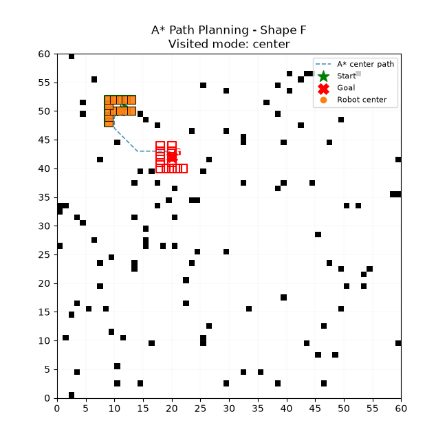
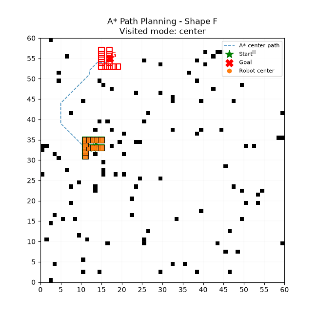
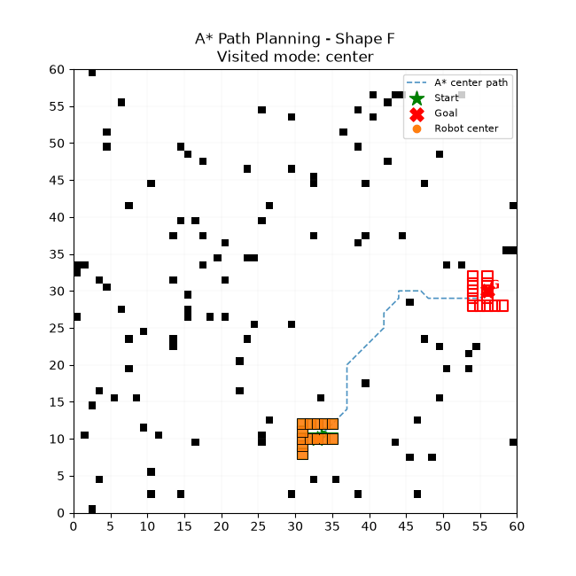

# A* 路径规划器

一个基于纯 A* 的移动机器人路径规划示例，支持任意形状（通过 ASCII 图案定义）的机器人，在 `(x, y, yaw)` 三维状态空间中进行搜索，保证运动安全。运行时会实时标记机器人走过的栅格，方便直观查看探索/行驶轨迹。

---

## ✨ 特性

- **任意形状机器人**  
  通过 ASCII 图案定义机器人 footprint，可自由扩展。

- **3D 状态空间 A\***  
  状态为 `(x, y, yaw_bin)`，同时规划位置与朝向，满足带朝向约束的路径规划需求。

- **连续扫掠碰撞检测（Swept Collision Check）**  
  在相邻状态之间对线位移与角位移同步插值，逐步检查碰撞，避免高速穿越障碍。

- **双重碰撞判据**  
  同时检测膨胀后的障碍栅格与障碍栅格四个顶点，减少“擦角”导致的不安全路径。

- **走过的栅格可视化**  
  动画运行时持续把机器人已经过的栅格标记为不同颜色：
  - `center`：仅标记机器人中心经过的栅格；

---

## 📁 目录结构
```
.
├── Complete_AStar_Path_Planner_Visited_Grid.py       # 主程序
├── gifs/       # 自动生成的 GIF 输出目录
└── README.md
```

---

## 🛠️ 环境依赖

- Python 3.8+
- numpy
- matplotlib
- pillow（用于保存 GIF）

安装依赖：

```bash
pip install numpy matplotlib pillow 
```

---

## 🚀 快速开始

直接运行：

```bash
python Complete_AStar_Path_Planner_Visited_Grid.py
```

程序会：

1. 随机生成一张带障碍的栅格地图；

2. 随机采样合法起点与终点（带指定朝向）；

3. 在 `(x, y, yaw_bin)` 空间执行 A* 搜索；

4. 打开 matplotlib 动画窗口，实时显示机器人运动与走过栅格；

5. 在 `./gifs/` 下保存动画 GIF。

---

## ⚙️ 可配置参数

脚本顶部集中了所有可调参数，方便修改实验：

| 参数 | 含义 | 默认值 |
| --- | --- | --- |
| `GRID` | 栅格地图尺寸 (W, H) | `(60, 60)` |
| `YAW_DIV` | 朝向离散份数 | `16` |
| `CLEARANCE_CELLS` | 障碍膨胀的安全距离（格） | `1.0` |
| `TESTS` | 随机测试轮数 | `6` |
| `ROBOT_SHAPE` | 机器人形状 | `"F"` |
| `START_YAW_DEG` | 起点朝向（度） | `0.0` |
| `GOAL_YAW_DEG` | 终点朝向（度） | `90.0` |
| `VISITED_MODE` | 走过的栅格标记模式，`"center"` / `"footprint"` | `"center"` |
| `VISITED_COLOR` | 走过栅格的颜色 | `"#4DB6E8"` |
| `VISITED_ALPHA` | 走过栅格透明度 | `0.62` |
| `SHOW_PATH_LINE` | 是否绘制 A* 中心轨迹线 | `True` |
| `ANIMATION_INTERVAL_MS` | 动画帧间隔（ms） | `400` |

---

## 🧠 算法说明

### 1. 状态空间

```
state = (x, y, yaw_bin)
```

- `x, y`：栅格坐标（整数）
- `yaw_bin`：朝向离散编号，共 `YAW_DIV` 份

### 2. 邻域扩展

在每个状态上扩展 `3 × 3 × 3 = 27` 个邻域动作（含原地转向），每个动作代价：

```
cost = hypot(dx, dy) + |dz| * 0.3
```

### 3. 启发函数

采用 8 邻域 Octile 距离：

```
h = sqrt(2) * min(dx, dy) + |dx - dy|
```

### 4. 扫掠碰撞检测

对相邻两个状态做线位移 + 角位移同步插值，逐步检测是否碰撞，避免“跨越”障碍。

### 5. 碰撞判据

- 膨胀后的障碍栅格（欧式圆形膨胀）；
- 障碍栅格的四个顶点；
- 地图边界。

---

## 🖼️ 可视化说明

- **灰色**：障碍栅格；
- **浅蓝半透明**：机器人走过的栅格；
- **蓝色虚线**：A* 中心轨迹；
- **绿色星号 + 绿色方块**：起点及其 footprint；
- **红色 X + 红色方块**：终点及其 footprint；
- **橙色圆点 + 橙色方块**：机器人当前位置与当前 footprint。


---

## 🎬 演示





---

## 📄 License

MIT License

---

## 🙌 参考与致谢

- A* 算法：Hart, P. E., Nilsson, N. J., & Raphael, B. (1968)
- Octile 启发函数：常见 8 邻域栅格启发式
- 内容来源已授权License合规 Github账号： [@fanzexuan](https://github.com/fanzexuan)

---
